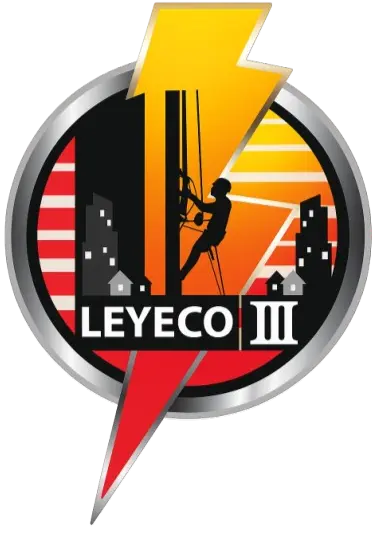
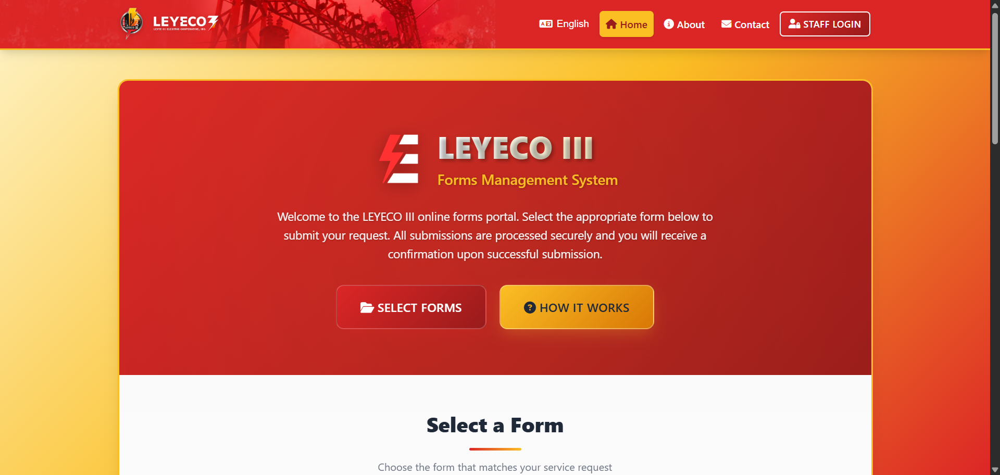
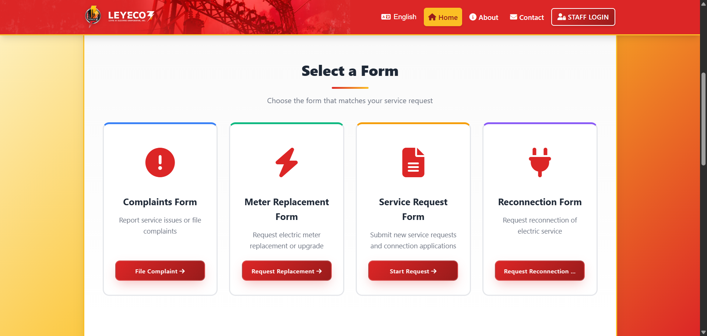
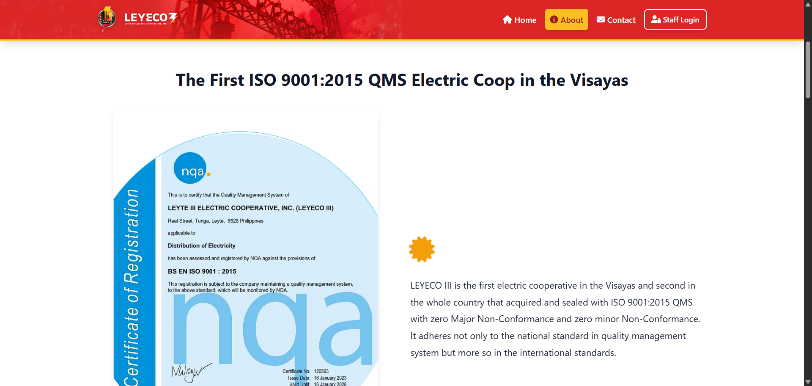
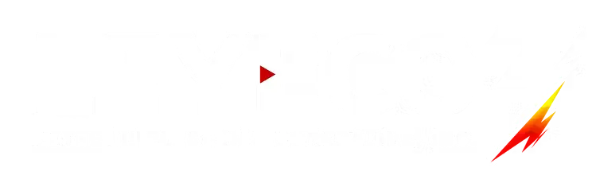

# 
# LEYECO III Forms Management System

A **Frontend-Only Showcase** for the LEYECO III Forms Management System. Explore the complete static UI/UX implementation without backend or database requirements.

## Features

- **UI Showcase**: Pixel-perfect static templates for Complaints, Meters, and Requisitions.
- **Bilingual Support**: Instant toggle between **English** and **Waray-Waray**.
- **Interactive Maps**: Real-world location selection powered by **Leaflet.js**.
- **Tracking System**: Visual UI for reference code status tracking.
- **Zero Backend**: 100% client-side — runs directly from `index.html`.
- **Responsive**: Fluid design optimized for both office and field use.

  

  
  

## Technology Stack

  

| Layer | Library / Tool |
|---|---|
| **Core Architecture** | HTML5, CSS3, Vanilla JavaScript |
| **Mapping Utility** | Leaflet.js |
| **Assets & Media** | Optimized WebP / SVG |
| **Typography** | Inter / System Sans-Serif |
| **Version Control** | Git |

---

## 🔗 Full System

  <b> Complete documentation version</b> 
  Featuring PHP 8.2, MySQL, and PHPMailer integration.

  

---

## ©️License

This front-end project is licensed under the [MIT License](LICENSE).

Copyright (c) 2026 Jaderby Garcia Peñaranda.

---

  
   
  <i>Lighting Houses, Lighting Homes, Lighting Hopes</i>

